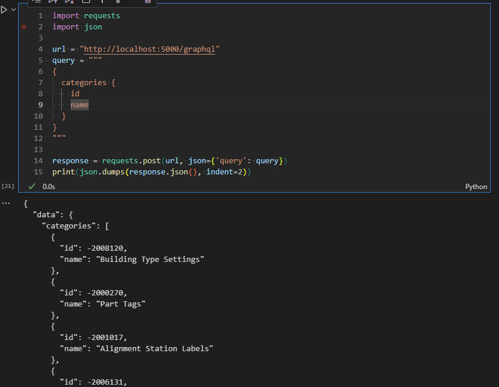

# RevitMCPGraphQL

A Revit add-in that exposes a GraphQL API for querying Revit data. Built with .NET 8 and ASP.NET Core, this project allows you to interact with Autodesk Revit models using GraphQL queries or from Python.



## Features
- Host a GraphQL server inside Revit
- Query Revit elements, categories, and parameters
- Health check endpoint
- Python client for easy testing

## Requirements
- Autodesk Revit 2024 or newer
- .NET 8 SDK
- Visual Studio, JetBrains Rider, or compatible IDE
- Python 3.8+

## Getting Started
1. **Clone the repository**
   ```sh
   git clone <your-repo-url>
   ```
2. **Open the solution** in your IDE.
3. **Restore NuGet packages**
   ```sh
   dotnet restore
   ```
4. **Build the solution**
   ```sh
   dotnet build
   ```
5. **Deploy the add-in**
   - The build process copies the add-in files to the Revit Addins folder.
   - Start Revit and the add-in will be available.

## Usage
- When Revit starts, the add-in will launch a GraphQL server on a local port (default: 5000).
- Health check: open [http://localhost:5000/health](http://localhost:5000/health) in your browser or use a GET request.
- Use the `/graphql` endpoint for queries from any GraphQL client or from Python.

## Python Client
A ready-to-use Python client is provided in `python-mcp/mcp_client.py`.

### Example usage:
```sh
cd python-mcp
pip install requests
python mcp_client.py
```
This will print the results of health, categories, elements, and rooms queries.

You can also import and use `MCPClient` in your own Python scripts.

## Project Structure
- `RevitMCPGraphQL/` - Main add-in source code
- `Commands/` - Revit external commands
- `Resources/` - Icons and resources
- `python-mcp/` - Python client for testing and automation

## License
MIT License Created by chuongmep.com
