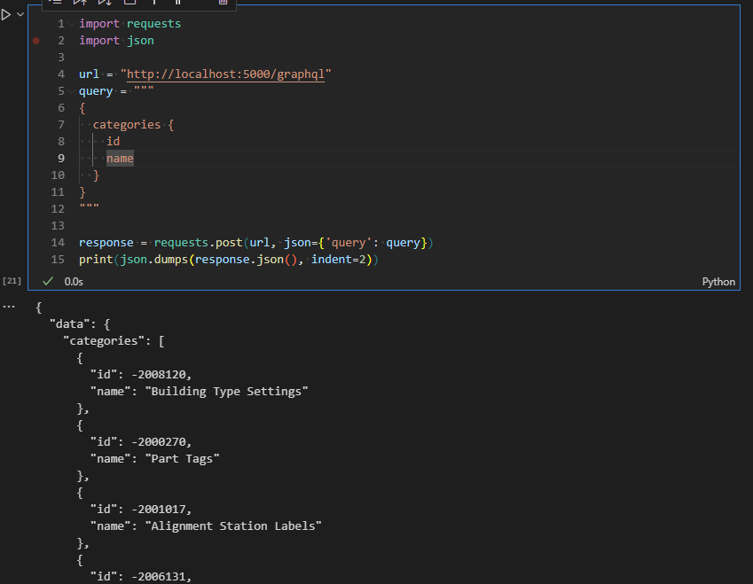

# RevitMCPGraphQL

Exposes a lightweight GraphQL API inside Autodesk Revit for both read and write operations. You can query model data, inspect selection/context, and run safe editing commands (mutations) — all from GraphQL or a Python client.



## Highlights
- Runs an in-process HTTP GraphQL server inside Revit
- Modular query + mutation architecture (contributors)
- Broad query coverage: document, categories, elements, rooms, levels, views, families/instances, project info, materials, worksets, phases, design options, links, sheets, grids, schedules, project location, warnings, element types, units, coordinates, elements by category, elements in bounding box, active view and selection, element relationships, model health
- Practical mutations: set parameters (single/batch), change type, move, rotate, delete, create family instance, duplicate view, create sheet, export/import schedules to/from Excel
- Simple health endpoint and native JSON variables
- Optional Python MCP client/server for automation and AI tooling

## Requirements
- Autodesk Revit 2021–2027 (multi-targeted). Most features validated on 2024/2025.
- .NET Framework 4.8 for Revit 2021–2024; .NET 8 for Revit 2025–2026; .NET 10 for Revit 2027 (handled by csproj configurations)
- Windows 10/11
- Python 3.8+ (only if using the Python client / MCP server)

## Install and Build
1) Clone
    - git clone https://github.com/chuongmep/RevitMCPGraphQL.git

2) Open the solution in Rider or Visual Studio

3) Restore and build
    - dotnet restore
    - Select the Revit configuration matching your version (e.g., "Debug R24", "Debug R25", "Debug R26", or "Debug R27") and build

4) Deploy
    - The project uses Nice3point.Revit.Build.Tasks to copy the .addin and binaries to your Revit Addins folder on Debug builds automatically

## Run in Revit
- Start Revit and open a model
- In the Add-Ins tab, use the Start button to launch the server (Stop to shut it down)
- A free port between 5000–6000 is chosen automatically; a dialog shows the exact URL
   - Health: http://localhost:<port>/ or /health
   - GraphQL: http://localhost:<port>/graphql (POST)

Tip: If you rely on a fixed port (e.g., tests), set REVIT_GRAPHQL_URL to the shown URL when launching tools.

## GraphQL usage
Send HTTP POST to /graphql with JSON body:
{ "query": "{ health }" }

Variables are supported via the standard { query, variables } payload.

### Queries (selection)
- health: String
- document
- categories(limit)
- elements(limit)
- familyTypes(limit)
- rooms(limit)
- levels(limit)
- views(limit)
- families(limit)
- familyInstances(limit)
- projectInfo
- elementsById(ids: [ID!]!)
- materials(limit)
- worksets(limit)
- phases(limit)
- designOptions(limit)
- links(limit)
- sheets(limit)
- grids(limit)
- projectLocation
- warnings
- elementTypes(limit)
- elementsByCategory(category: BuiltInCategoryEnum!, limit)
- elementsInBoundingBox(minX,minY,minZ,maxX,maxY,maxZ, limit)
- activeViewAndSelection { activeView { id name } selectionIds }
- units { typeId name symbol }
- coordinates(documentId): Key coordinate base points for the project
- schedules(documentId): List of schedules in the document
- elementRelationship(elementId: ID!, documentId): Get relationships for an element (super component, host, dependents, joined elements)
- modelHealth(documentId): Quick model health summary (warnings count, element counts, rooms without areas)

### Mutations (editing)
- setElementParameter(elementId: ID!, parameterName: String!, value: String!): Boolean
- setElementParametersBatch(inputs: [ElementParametersInput!]!): Boolean
- setElementType(elementId: ID!, typeId: ID!): Boolean
- moveElements(elementIds: [ID!]!, translation: VectorInput!): Boolean
- rotateElements(elementIds: [ID!]!, point: PointInput!, axis: VectorInput!, angle: Float!): Boolean
- deleteElements(elementIds: [ID!]!): Boolean
- createFamilyInstance(symbolId: ID!, location: PointInput!, levelId: ID, structuralType: String): ID
- duplicateView(viewId: ID!, withDetailing: Boolean): ID
- createSheet(titleBlockTypeId: ID, sheetNumber: String, sheetName: String): ID
- exportSchedulesToExcel(filePath: String!, scheduleIds: [ID]): String - Export schedules to Excel, returns output file path
- importScheduleFromExcel(filePath: String!, scheduleId: ID!): Int - Import parameter values from Excel into schedule elements, returns count of updated elements

Input types
- PointInput { x: Float!, y: Float!, z: Float! }
- VectorInput { x: Float!, y: Float!, z: Float! }
- ElementParametersInput { elementId: ID!, parameters: [ParameterSetInput!]! }
- ParameterSetInput { parameterName: String!, value: String! }

Notes
- Angles are radians; geometry units use Revit internal units (e.g., feet)
- Parameter setting currently uses string values; typed storage handling can be extended

## Python client and MCP server
Location: python-mcp/
- mcp_client.py — minimal client hitting the GraphQL endpoint
- revit_mcp_server.py — MCP stdio server wrapping GraphQL operations
- revit_mcp_server.cmd / run_revit_mcp_server.bat — convenience launchers on Windows

Quick start
```powershell
cd python-mcp
py -m pip install -r requirements.txt
# or: python -m pip install -r requirements.txt
py mcp_client.py
```

Launch MCP server for an MCP-enabled client
```powershell
python-mcp\revit_mcp_server.cmd
```

If you run the Python file directly:
```powershell
cd python-mcp
py revit_mcp_server.py
# or: python revit_mcp_server.py
```

VS Code MCP configuration (create .vscode/mcp.json in your workspace)
```json
{
  "servers": {
    "revit-mcp-graphql": {
      "command": "py",
      "args": ["python-mcp/revit_mcp_server.py"],
      "cwd": "${workspaceFolder}/python-mcp",
      "env": {
        "REVIT_GRAPHQL_URL": "http://localhost:5000/graphql"
      }
    }
  }
}
```

**Windows Note:** Use `"command": "py"` (Python launcher) instead of `"command": "python"` to avoid issues with the Windows Store Python alias, which doesn't work properly with stdio-based MCP servers.

Alternative using full path:
```json
{
  "servers": {
    "revit-mcp-graphql": {
      "command": "C:\\Users\\YourUsername\\AppData\\Local\\Programs\\Python\\Python312\\python.exe",
      "args": ["revit_mcp_server.py"],
      "cwd": "${workspaceFolder}/python-mcp",
      "env": {
        "REVIT_GRAPHQL_URL": "http://localhost:5000/graphql"
      }
    }
  }
}
```

For user profile configuration (available in all workspaces), run **MCP: Open User Configuration** in VS Code Command Palette to edit the global mcp.json file.

### Troubleshooting MCP Connection Issues

**Error: MCP error -32000: Connection closed**

This error typically means the MCP server process exits immediately after starting. Common causes:

1. **Windows Store Python alias issue** - The `python` command on Windows may resolve to a Windows Store alias that doesn't work with stdio redirection.
   - **Fix:** Use `py` (Python launcher) or the full path to python.exe in your MCP configuration
   - **Check:** Run `where python` in PowerShell. If it shows `C:\Users\...\WindowsApps\python.exe`, you're using the alias

2. **Missing dependencies** - The fastmcp and requests packages aren't installed.
   - **Fix:** Run `py -m pip install -r requirements.txt` in the python-mcp directory
   - **Check:** Run `py -c "import mcp; print('OK')"` to verify

3. **Revit GraphQL server not running** - The MCP server needs the Revit GraphQL endpoint to be available.
   - **Fix:** Start Revit and launch the GraphQL server using the Add-Ins tab
   - **Check:** Visit http://localhost:5000/health in a browser

4. **Port mismatch** - The MCP server is configured for the wrong port.
   - **Fix:** Set `REVIT_GRAPHQL_URL` environment variable to match the actual server URL shown in Revit's dialog

## Project structure
- RevitMCPGraphQL/
   - Server/: lightweight HttpListener server and lifecycle manager
   - GraphQL/
      - Queries/: modular IQueryContributor classes + DTOs and Types
      - Executes/: modular IMutationContributor classes + Inputs
   - RevitUtils/: ExternalEvent-based dispatcher for safe Revit-thread access
   - Resources/: icons
- python-mcp/: Python client + MCP stdio server

## License
MIT — © chuongmep.com
